# 📰 **NEWS DETECTIONS FOR FAKE AND CLUSTERING OF TYPES OF NEWS**

### 📊 **Machine Learning Applications**  
### 🧠 **Course 2024 -2025**

- Carolina López De La Madriz 100475095
- Álvaro Martín Ruiz  100475318
- Emma Rodriguez Hervas 100475225
- Jaime Salafranca Pardo 100475216

### Table of Contents

1. Introduction	
2. Data and preprocessing	
2.1.  Problem statement	
2.2.  Where does the dataset come from	
2.3.  Preprocessing	
2.4.  Exploratory Data Analysis	
3. Natural Language Processing	
4. Machine Learning	
4.1. Classification task: Fake News Detection	
4.2. Clustering: Types of News	
4.3. Recommendation Systems: Real News Recommendations after Fake News	
5. Dashboard	
6. Conclusions	

### Introduction

The rapid advancement of Natural Language Processing (NLP) and text generation technologies has contributed to the growing prevalence of fake news. With the help of generative multimedia, such content has become increasingly convincing, making it difficult to distinguish real from fake information. This project explores whether the authenticity of news articles can be determined using only their textual content.
The project uses a dataset containing news articles and their corresponding labels (REAL or FAKE) and is structured around three main objectives. The first is to develop a classification model capable of predicting the veracity of a given news article. The second involves identifying the genre or topic of each article, offering further context and insights into news patterns. The final task is to implement a recommendation of news that, upon detecting a fake article, suggests a related real article to provide users with accurate alternatives.
These features are integrated into a dashboard interface, allowing users to input news content, verify its authenticity, explore its genre, and access reliable related information in case of misinformation.
Is it necessary to have the whole text or context of the news to predict the veracity of the news? Can we just predict the veracity with the length of the news or the length of the title? Is the title enough to predict the veracity of the news, or the type of news? The answers to those questions are the principal target of the work and not only the prediction itself. It is known that having a powerful model that can predict the veracity of the news is a great tool, and it is achievable, nevertheless, there are several computational and energetic issues with large models, which can consume a lot of resources. It is for that reason that checking how different methods work is an interesting approach, as reducing the amount of data, parameters, and weights is very relevant for the good implementation in large-scale models.

#### Data and preprocessing

This part of the report explains how the data has been obtained and preprocessed to achieve a clean dataset useful for the different tasks. The observation and exploratory analysis held, and the decisions taken for the data preprocessing, are also explained in this section.

#### 2.2.  Where does the dataset come from

The extraction of news is a critical point in the analysis of fake and real news. This and difficulties faced will be explained, as well as how the news can be obtained for more precise and future work. In an ideal case, the dataset could be created from recent news and applied to a certain sector. There are several API’s that work very well to obtain news with title and text. 

For the scope of this project, we have used the GoogleNews API and an APINews for extracting some news. The problem with these APIs is the amount of news that can be scraped per day and person. In the free version, this amount is limited to less than a thousand. As there is no financial support to construct the dataset, we have used the code to understand how the data would be scraped, but we have used a dataset available on Kaggle, which replicates the results we would have. To build the dataset, we have used a FAKE news dataset with source publication date, title, and text. A similar dataset with REAL news was merged, creating a binary target value.

#### 2.3.  Preprocessing and Exploratory Data Analysis

In the created dataset, we have a target variable as well as a title and a text variable for approximately 4000 news articles for Real and 4000 for Fake news. But those variables hide some other ones as the length of the news and the number of word variables that we are going to create. Once created, those variables will be used in preprocessing to see if it is interesting to work with.

We can observe in Figure 1 and Figure 2, the count of words per article and the length of articles. As the distribution of the fake news and real news seems different, we can draw the hypothesis that those variables are very interesting, and that we could predict the veracity due to this. We will investigate it and compare models that also use the content of the news, and not only the metadata. 

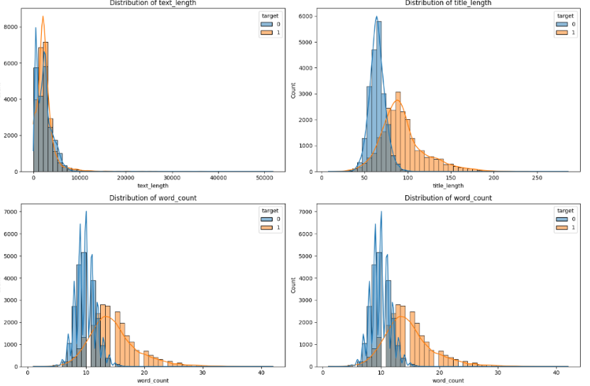

    Figure 1: Distribution of Length		   Figure 2: Distribution of word count

The rest of the preprocessing of the data consists of only checking if all the news is completed, that is, not having NANs in the text and of title. In this case, as we have decided not to spend money and time scraping the data, our imported data does not have NAN values in any case and is nearly already preprocessed. It is also interesting to look simply at the most common words for both classes to get some interesting information for Natural Language Processing. It is that way we were able to discover a problem in the dataset. All the “ ‘ “ had been deleted. This is a big problem for solving contractions.

#### Natural Language Processing

Once the dataset has been preprocessed, we may start to do the Natural Language Processing, This step is critical as it will determine the accuracy of our future model, but also the computing times and costs. To do the Natural Language Processing, a pipeline will be defined, and some different techniques will be tested and contrasted to make the decision. The base skeleton of the pipeline will be inspired by the notebooks used in class and as homework. Even if all the steps of the pipeline will be executed together, they will be divided for explanation purposes in this report.

## 3.1. Step 1: Text Processing

In our text processing pipeline, we will first remove the HTML structure and convert it to text using BeautifulSoup. The raw text is then parsed with the lxml parser to remove any embedded HTML tags, preserving only the visible textual content. Then we will extract the URL. This is a critical decision because some fake news could have url to possibly fraudulent or virus-infected web pages, which could be of great help for deciding whether the news is false or true. Nevertheless, we have decided to delete them as we want the text just to be the content of it and not metadata such as links or pictures. When reading news, the links are usually not visible but inserted in words, which makes them ‘invisible’ to readers.  Moreover, using the same library, we will recreate all the lost contractions by placing “ ‘ “ where there should be one.
Then the library contractions are used to remove and fix the contraction. This is a good technique usually used to improve text processing. The NLP function, which is the en_core_web_sm from Spacy, is used, which performs tokenization, part-of-speech tagging, and lemmatization. Tokens are reduced to their base forms (lemmas), converted to lowercase, and filtered to exclude stop words, punctuation, and non-alphabetic tokens. A second lemmatization pass is applied using the WordNet Lemmatizer (wnl), which can offer improved normalization based on WordNet’s lexical database. A final filtering step removes any remaining stop words defined in a custom or standard stopword list.

Even if the Spacy function already provides the necessary preprocessing, it is interesting to redo some steps to verify that no stop words are added. This pipeline will be applied separately to the Title and the rest of the text; this will be like that for the whole project, as the content of the title and the one in the text is very different, and we do not want to merge them. Once we have the Text processing, we can start the Text Vectorization.

After this first Pipeline, we introduced several additional improvements. First, we performed named entity recognition (NER) during preprocessing using SpaCy to identify and optionally retain key named entities such as individuals, organizations, and geopolitical locations, which could enhance thematic analysis. We also applied bigram and trigram detection using Gensim’s Phrases model to capture multi-word expressions like "climate change" or "white house", which are semantically richer than their components. In addition, we tested language detection and filtering to remove non-English documents and ensure consistency across the corpus.

## 3.2. Step 2: Text Vectorization

For the text vectorization, we have explored several techniques, including BoW and TFIDF. During the exploration, we test several techniques and use plots and metrics to understand which will be the most appropriate one for the rest of the work. For this exploration work, we reduce the size of the dataset to 1000 observations. Once we have an idea of the results, we can do it for the whole dataset.

Initially, we built a dictionary from the processed text using the Gensim library. During dictionary construction, we removed extremely common words that appeared in more than 70% of the documents, as these offered limited discriminative power.

At the other end of the spectrum, we also filtered out rare words that occurred in fewer than five documents, which tend to introduce noise. With this refined vocabulary, we computed Bag-of-Words (BoW) vectors that represented the raw frequency of each term in each document. We also calculated TF-IDF (Term Frequency-Inverse Document Frequency) vectors, which adjust term frequencies based on how uniquely they are distributed across the corpus. These two classical representations were compared both visually and quantitatively. Nevertheless, we already know that these techniques are not widely used in diffraction of other techniques such as FastText, Doc2Vec and GloVe.

In Figure 3 and in Figure 4, we can see the effect of erasing the more typical words.

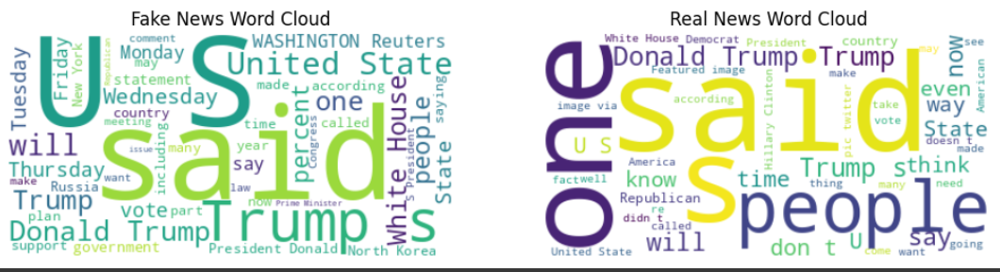     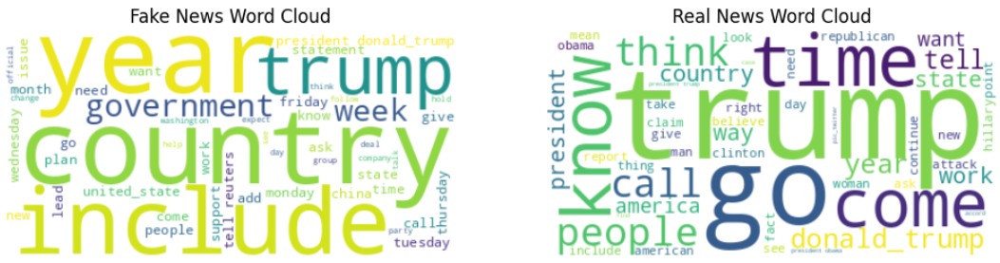

    Figure 3: WordCloud Before extracting common words			Figure 4: WordCloud after extracting common words

That is why we implemented Doc2Vec. Doc2Vec is an extension of Word2Vec that generates dense, fixed-length vectors representing entire documents. It considers word context and document-level semantics by training embeddings jointly with document identifiers. We trained separate models for titles and texts using Gensim's Doc2Vec, and inferred document embeddings, which we store in doc2vec_text_df and doc2vec_title_df. We also used a pretrained GloVe model, which is a pretrained word embedding model that captures semantic similarity by factorizing a word co-occurrence matrix. We average the GloVe vectors of words in each document to obtain a dense representation. We use the glove-wiki-gigaword-50 pretrained model from Gensim’s API to vectorize both titles and texts. 

Then we computed LDA. In this case, we had to compare the titles approach and the text approach. Comparing the Coherence metric for a number of topics and for a corpus made with BoW or TFIDF.  Obtaining the following results. Where we observe a very good coherence for 12 topics Figure 5. Nevertheless as seen in Figure 6, we must say that the topics have all a very little representativity while one topic had a big one. The eleven remaining topics where all very closed to each other. That is why we decided in this case to take 2 topics. Nevertheless for the titles the 12 topics where very interesting. 

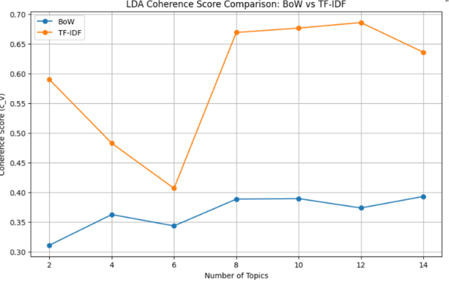                     	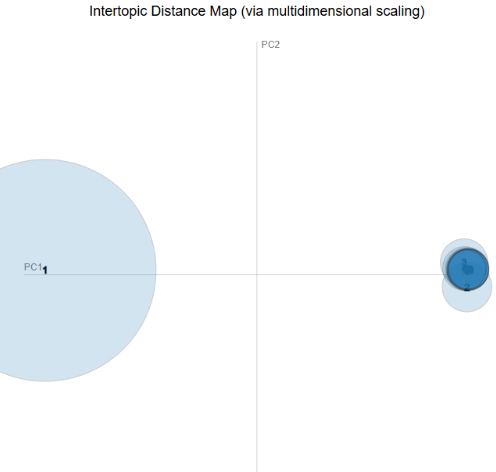  

    Figure 5: Coherence metrics					                            Figure 6: LDA not selected

For titles we obtained the following topic representation  Figure 7, we can observe a more interesting separation between topics.

  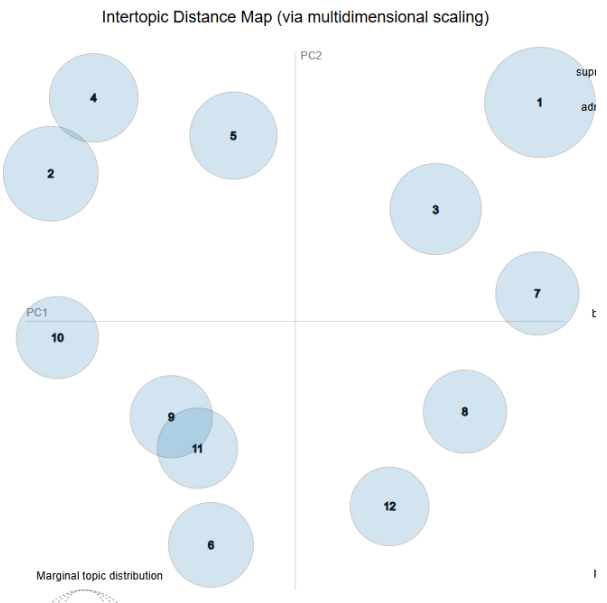  

       Figure 7: Final LDA for the titles

       
Moreover we also compared Non-Negative Factorization, NMF is a linear-algebra-based technique for topic modeling that decomposes the TF-IDF matrix into document-topic and topic-word matrices. Unlike LDA, NMF does not assume a generative model but can yield more coherent topics in some cases. We applied NMF using sklearn to extract interpretable topics from the TF-IDF matrix. We also found interesting topics. We used a BERT based sentence transformer, BERTopic combines transformer embeddings (like BERT) with clustering algorithms and topic reduction to create interpretable topics. It captures rich semantic and contextual relationships between words, outperforming traditional methods in many real-world settings. We applied BERTopic to analyze and visualize meaningful topics in the news corpus.

 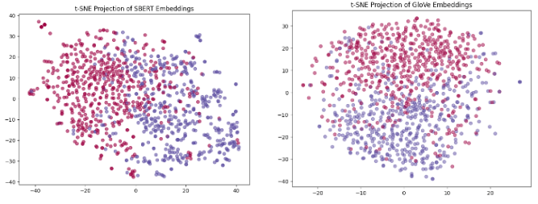

 
     Figure 8: Visualization of the vectorisation techniques

Comparing the GloVe and BERT models, we can see that the FAKE and REAL observations are separable, so this means that we can find a good model to approximate them.
Finally, we compare using the cosine similarity between the news to understand which vectorization techniques to use for classification. We compute the similarities intra REAL and intra FAKE as well as between groups, trying to find a high REAL and FAKE intra similarity and a low extra similarity. That is why we decided to use doc2vec for text and GloVe for the title.

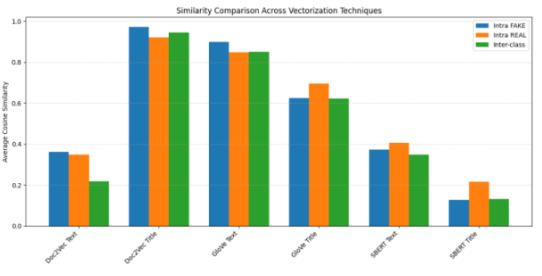

       Figure 9: Selection of vectorization technique

## 3.Machine Learning

Once the natural Processing is realized, our Machine Learning work and analysis can start, as previously mentioned, the idea is first to realize a classification by selecting different variables and testing several models. Then we will use clustering to see if we can create groups of news and understand this clustering. This could be interesting to understand if we can detect populist news or just topic-related news. In this case, the results we are looking for are not as topic-related as our LDA model already does well, but rather trying to detect some tendencies of speech in news.
Finally, the recommended systems has for objective to detect similarities between real and fake news and recommended in case of detecting that a new iis fake, the 2 most similar Real news, This is interesting as it not only destroys the propagation of Fake news but also directly changes the mindset of the reader and in a quick period it can introduce the real point of view in to the readers mind.

#### 4.1. Classification task: Fake News Detection

In this classification task, our primary objective is to maximize the accuracy of fake news detection while keeping computational complexity and training time as low as possible. However, given the nature of the problem, certain evaluation metrics are more informative than overall accuracy. Specifically, recall is a key metric of interest, since our goal is to identify all instances of fake news, even at the cost of misclassifying some real news as fake. In other words, we prioritize minimizing false negatives, which would allow fake news to go undetected. Nevertheless, to balance between precision and recall, we will also consider the F1-score, and for a more comprehensive evaluation of classifier performance, we will compare models using the ROC-AUC score. All metrics will be summarized and presented in a comparative table at the end of this section.

To establish a baseline, our first model is a simple linear regression classifier that uses basic structural features such as the length of the news title, measured both in terms of word count and character count. This model, although naive, provides a lightweight benchmark with minimal computational cost and allows us to assess whether superficial cues alone carry predictive signal.

Next, we advance to models that leverage textual embeddings. First, we construct a classifier that uses only the title of the article, which is transformed into a vector representation using pre-trained word embeddings such as GloVe. This approach captures semantic relationships and contextual meaning within the title, offering richer information than simple length features. We then build a separate model using only the full body of the article, which provides more comprehensive context and detail. While this can significantly improve predictive power, it also increases computational demands due to the greater input size and complexity of the embedding space.

Finally, to develop a more robust solution, we explore the combination of both title and content embeddings to train more sophisticated classifiers. We apply a range of machine learning algorithms, including Random Forests, which are well-suited for handling nonlinear relationships and feature importance; Support Vector Classifier (SVC), known for their strong performance on high-dimensional text data; and Neural Networks, which are particularly effective when working with dense embedding vectors and complex patterns.

By systematically comparing these models, both in terms of performance metrics and resource requirements, we aim to identify the most effective and efficient strategy for fake news detection.

| Benchmark     | Title LR | Title RF | Title SVM | Title Neural | All LR | All RF | All SVM | All Neural |
|---------------|----------|----------|-----------|--------------|--------|--------|---------|------------|
| 0.89          | 0.89     | 0.92     | 0.94      | 0.96         | 0.94   | 0.95   | 0.96    | 0.98       |

  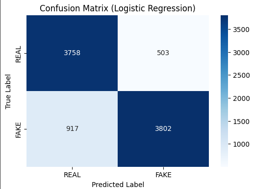  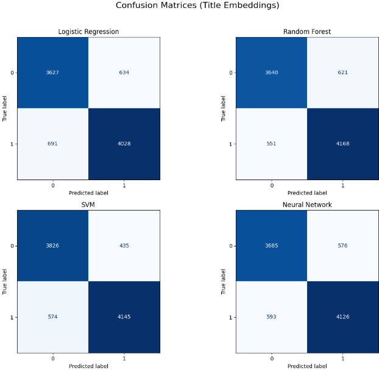   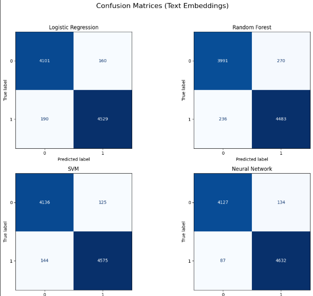 

                                Figure 10: Models tested for regression

As seen in the table and computing times, our final decision is to take the SVM models for both only title prediction and also title and text prediction. The decision frontier is pretty clear in the following graphs.

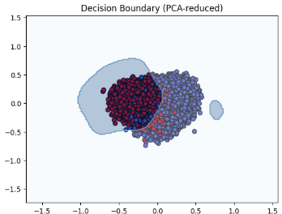           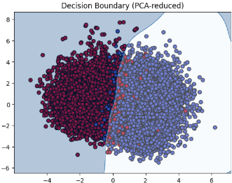

             Figure 11: SVC models visualization

##### 4.2. Clustering: Types of News 

This clustering task is an exploration idea in which we want to understand is we can detect some tendencies in the news, a clustering in function of the topic is not the main objective for us, but more a sentiment clustering which could be able to detect Right wing, Neutral, or Left Wing influenced news. This could also be interesting if found, as for a reader it could be interesting to have recommended news similar to the one that he is reading, but from the opposite political spectrum.

If we use an elbow technique over the number of clusters to decide how many of them to use, we obtain 5 clusters. And plotting the obtained clusters over the PCA1 and PCA2 we get the following images.

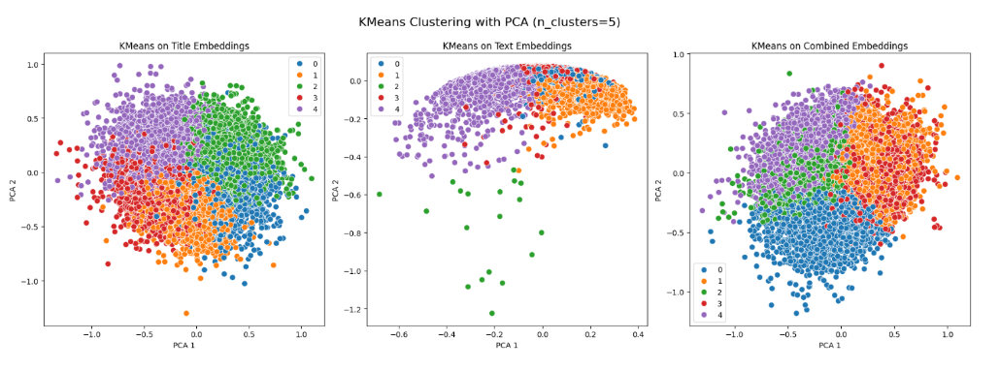

This is interesting if we compare it to the the distribution of False and TRUE news over PCA1 and PCA2.

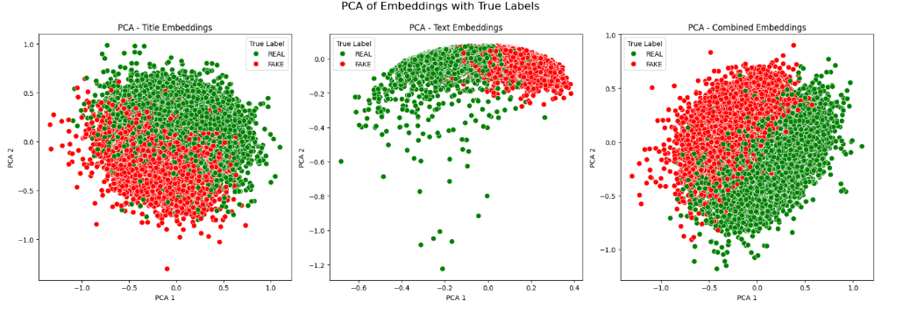

In the second step of the analysis, we transformed the preprocessed texts into numerical vector representations to enable machine learning models to process and analyze them. We explored a wide range of vectorization strategies, starting with traditional statistical methods and progressing toward modern embedding-based models.

Using both BoW and TF-IDF representations, we trained Latent Dirichlet Allocation (LDA) models to uncover latent thematic structures within the corpus. To determine the optimal number of topics, we employed coherence scoring using the c_v metric. We tested a range of topic counts, typically from 5 to 50, and selected the number of topics that maximized coherence. While LDA is traditionally applied using BoW vectors, we also experimented with training LDA using TF-IDF representations, as recent literature suggests this may improve the semantic clarity of topics in some cases.

Beyond classical models, we also explored word embeddings using Word2Vec and GloVe, both of which generate dense vector representations for individual words. These embeddings were either pre-trained (e.g., on Google News or Common Crawl) or trained on our own corpus. To obtain document-level vectors, we tested multiple aggregation methods. The simplest was to average the word vectors of each document. However, we also applied TF-IDF weighted averaging, which places greater emphasis on informative words. In both cases, we applied Principal Component Analysis (PCA) or Singular Value Decomposition (SVD) to reduce the dimensionality of the resulting vectors and suppress noise. These steps aimed to produce document embeddings that preserved meaningful semantic structure while being computationally efficient.

After vectorizing out corpus with GloVe, we tried several unsupervised algorithms to see which, if any, discover coherent grouping using three different datasets: only news' titles, only texts, or both, combined. First of all, we perform Elbow Method and Silhouette Analysis in order to find the optimal number of clusters. For the first method, all three variants show a steadily decreasing inertia as k grows from 2 to 10, with no sharp elbow, suggesting that there is no single dominant cluster count. However, the Silhouette score peak at k = 2 for the three datasets, but are low. 

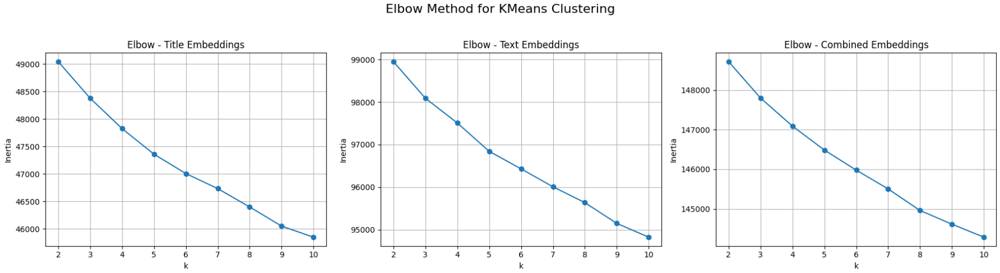
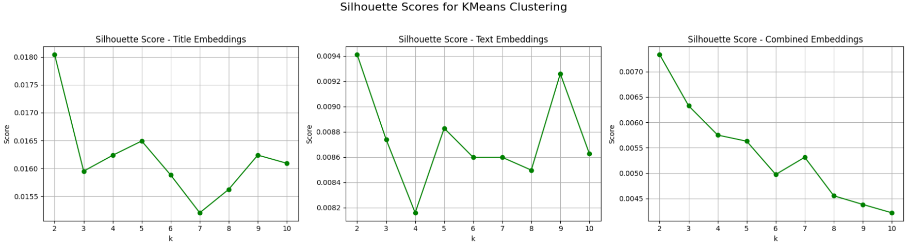

In the t-SNE visualization we project each dataset at its best k onto two dimensions and the resulting scatterplots remain a dense cloud confirming the Silhouette analysis that the clusters are not strongly separated. 

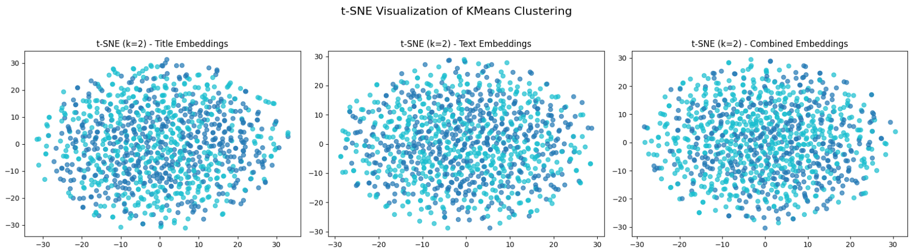

The next step was trying the different clustering algorithms, using 2 clusters, to compare them and evaluate their ability to recover meaningful groupings:

* K-Means: fast, centroid-based, uses similar spherical clusters
* Spectral Clustering: uses graph Laplacian eigenvectors to handle non-convex shape
* Gaussian Mixture Model: for soft assignaments and elliptical clusters
* Agglomerative Clustering: creates a hierarchy by merging the closest pairs
* HBDSCAN: density-based, finds cluster of varying density and robust to shape

The metrics used to evaluate the performance of each method were the Adjusted Rand Index (ARI) and the Normalized Mutual Information (NMI) which compare our clusters to the real values of the labels (REAL vs FAKE). Te results shows that HBDSCAN does not obtain any useful cluster, and the other algorithms give results pretty close to zero, which means that the clusters are not related with the labels. 

| Dataset              | Algorithm                   | Adjusted Rand Index | NMI     |
|----------------------|-----------------------------|---------------------|---------|
| Title Embeddings     | KMeans                      | 0.003363            | 0.003138|
| Title Embeddings     | Spectral Clustering         | -0.000886           | 0.000251|
| Title Embeddings     | Gaussian Mixture            | -0.000795           | 0.000439|
| Title Embeddings     | Agglomerative Clustering    | -0.001338           | 0.000370|
| Title Embeddings     | HDBSCAN                     | 0.000000            | 0.000000|
| Text Embeddings      | KMeans                      | -0.000324           | 0.000424|
| Text Embeddings      | Spectral Clustering         | 0.001300            | 0.001917|
| Text Embeddings      | Gaussian Mixture            | 0.000158            | 0.000763|
| Text Embeddings      | Agglomerative Clustering    | -0.000676           | 0.000043|
| Text Embeddings      | HDBSCAN                     | 0.000000            | 0.000000|
| Combined Embeddings  | KMeans                      | 0.000536            | 0.001821|
| Combined Embeddings  | Spectral Clustering         | -0.000963           | 0.000002|
| Combined Embeddings  | Gaussian Mixture            | 0.000536            | 0.001821|
| Combined Embeddings  | Agglomerative Clustering    | 0.002296            | 0.001739|
| Combined Embeddings  | HDBSCAN                     | 0.000000            | 0.000000|

However, the clutering's goal was not to obtain a classifier of True or False nor grouping topics, it was a sentiment clustering, so the metrics are not necessary determinant for our model. 

Next, we turn to Product2Vec, because it exhibited strong intra-class cohesiveness (average similarity of 0.79 for Fake and 0.77 for Real). It makes sense to evaluate whether these corpus-specific embeddings can capture the sentiment patterns needed to form coherent clusters. The best results are for the combined vectors and the titles, reducing the space to 2 components with PCA. With the Elbow Method we obtained that the best k was 2, and in order to obtain more specific groups we also use k = 5. 

Titles dataset, k = 2:

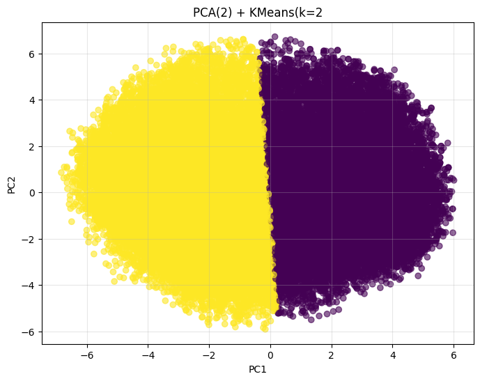

Combined dataset, k = 5: 

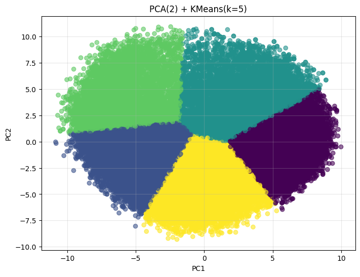

Althought the results appear visually well sepatated, with notable borders even when they touch, quantitative evaluation shows more modest performance, suggesting showing that articles still overlap and the embeddings don’t capture clear sentiment boundaries because averaging Word2Vec on our small corpus blurs key differences

| Dataset                  | k | Silhouette Score | Davies–Bouldin Index |
|--------------------------|---|------------------|----------------------|
| Titles                   | 2 | 0.433            | 0.926                |
| Combined                 | 5 | 0.370            | 0.885                |

We therefore move on to our strongest approach—GloVe embeddings with K-Means and PCA of 2 components, which delivers more reliable and interpretable clusters, being the simplest at the same time. Using the Elbow Method, we obtained that the best k is 5, and using the whole dataset, the best results have been for the Titles and the Combined, where we found the most clear groups as we can see in the following figures.

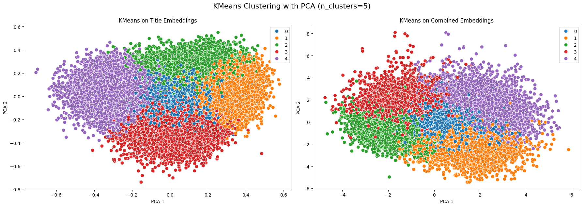

Below are three representative headlines from each of the 5 clusters of our final model. 

**Cluster 0**  
- **REAL**: WATCH: House Dem Has Had ENOUGH, Formally Starts Impeachment Proceedings Against Trump…  
- **FAKE**: Chicago mayor seeks rebound with new budget, labor peace…  
- **REAL**: Pro-Trump Group Is Now Using Pictures Of An Obama Rally To Make Trump Look Popular…

**Cluster 1**  
- **FAKE**: Merkel looks secure for now despite coalition chaos…  
- **FAKE**: EU gives formal green light to new Brexit phase…  
- **FAKE**: Colombia, ELN rebels agree temporary ceasefire starting Oct. 1…

**Cluster 2**  
- **FAKE**: More than 180,000 people, mostly Kurds, displaced by Iraqi-Kurdish conflict…  
- **REAL**: Muslim Internment Flyers SHOCK Students Of UC San Diego With Stark Warning…  
- **REAL**: “GUATEMALAN” MAN DIES After Falling Into WASTE GRINDER At Meat Plant…

**Cluster 3**  
- **FAKE**: Congress sends Obama bill on Zika drug development…  
- **FAKE**: Ex-FBI Director Comey’s prepared testimony to Senate panel…  
- **REAL**: Republican Committee Passes Bill That Would Prohibit Almost All Abortions In Florida…

**Cluster 4**  
- **REAL**: Fox News Host BEGS Republicans: Leave Trump ALOOOONE (VIDEO)…  
- **REAL**: NJ DEM RUNNING FOR CONGRESS Claims His Opponent Is Like A “Rural Alabama Conservative”…  
- **REAL**: Sean Hannity Tries To Bash CNN Reporter But It Immediately Backfires…

Ultimately, GloVe + K-Means yielded the most consistent and interpretable clusters, providing a useful foundation for our downstream recommendation system.

## 5. Dashboard
In order visualize and interact with the machine learning models we have created, we developed an interactive dashboard using Dash. The dashboard is a platform where we have integrated the three core functionalities of the project: classification of news as REAL or FAKE, clustering analysis, and real news recommendations following the detection of fake news.

**Dashboard Functionalities**

The dashboard is structured around tabs that facilitate navigation through it:

* Classify & Suggest: Users can input news articles (either full text or title only). When submitted, the dashboard classifies the article as FAKE or REAL using the optimized model. A visual horizontal bar indicates the prediction confidence (green for real news, red for fake news). Additionally, this functionality provides the top related articles within the same cluster, along with the most similar REAL news. This way we provide users some context in the prediction and verifying information.

* Cluster Finder: Allows users to input a news article to identify the cluster it belongs to. This helps in understanding the broader context or sentiment associated with the news, such as political inclination or thematic grouping. Users receive immediate feedback regarding the cluster assignment, enabling exploration of patterns and trends.

* True News by Topic: Presents news articles categorized by topics generated from the LDA analysis. This facilitates topic-driven exploration, providing users direct access to reliable articles organized under distinct themes identified by the LDA model.

* Fake News by Topic: The same as the previous functionality but specifically for fake news articles by topic. This is particularly useful for observing patterns in misinformation and identifying recurring deceptive themes.

* Explore by Cluster: Allows exploration of articles grouped by their respective clusters. The news are shown in a table where articles are labeled as REAL or FAKE, allowing detailed scrutiny of cluster compositions and the detection of underlying tendencies such as political bias or populist language.

[Watch the video](https://youtu.be/5UZiXaJ0hBU)

Here is the video link: https://youtu.be/5UZiXaJ0hBU

## 6. Conclusions

This project explored whether the authenticity of news articles can be predicted using only their textual content. We found that even simple features like title length or word count show strong signals, and that titles alone can offer reasonable predictive power. However, combining title and full-text embeddings (using GloVe and Doc2Vec) produced the most accurate results.
Through classification, clustering, and topic modeling, we gained insights into the structure and patterns of real and fake news. Our KMeans clustering showed that stylistic and thematic differences align with veracity. Finally, the implementation of a recommendation system, based on clustering, that suggests reliable articles when fake ones are detected adds value for users.
Overall, lightweight models based on minimal input can still be effective, making this approach suitable for scalable and efficient misinformation detection.
